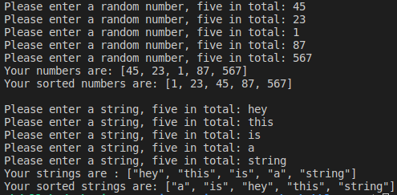

# Bubble Sort using Ruby

In this small project, we created two methods to sort an array in ascending order using the Bubble Sort algorithm

## Built With
- Ruby

## Deployment

This project can be deployed on any Ruby IDE by simply cloning or download the repository from github, which is available on this active [link](https://github.com/anewman15/bubble-sort)

- After cloning it.
- Run the file by typing "ruby bubble_sort.rb" in your terminal and follows the pop up questions.

## Live Demo
[Repl.it Demo Link](https://repl.it/@anewman15/Arafat-Abdullah-Bubble-Sort)
Cick the "run" button

## Authors
👤 **Abdullah Numan**
- Github: [@anewman15](https://github.com/anewman15)
- Twitter: [@aanuman15](https://twitter.com/aanuman15)
- Linkedin: [aanuman15](https://www.linkedin.com/in/aanuman15/)

👤 **Arafat Akata**
- Github: [@haraphat01](https://github.com/haraphat01)
- Twitter: [@haraphat01](https://twitter.com/haraphat01)
- Linkedin: [arafat-akata](https://www.linkedin.com/in/arafat-akata/)

## 🤝 Contributing
Contributions, issues and feature requests are welcome!
Feel free to check the [issues page](/issues).

## Show your support
Give a ⭐️ if you like this project!

## Acknowledgments
- https://www.theodinproject.com/
- https://launchschool.com/
- https://rubymonstas.org/
